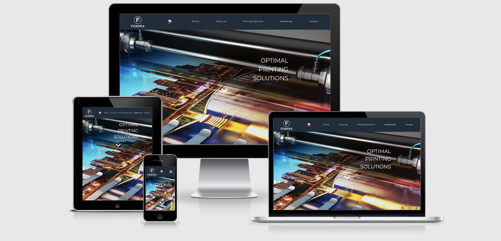
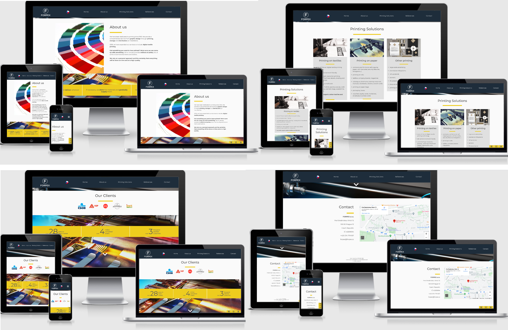
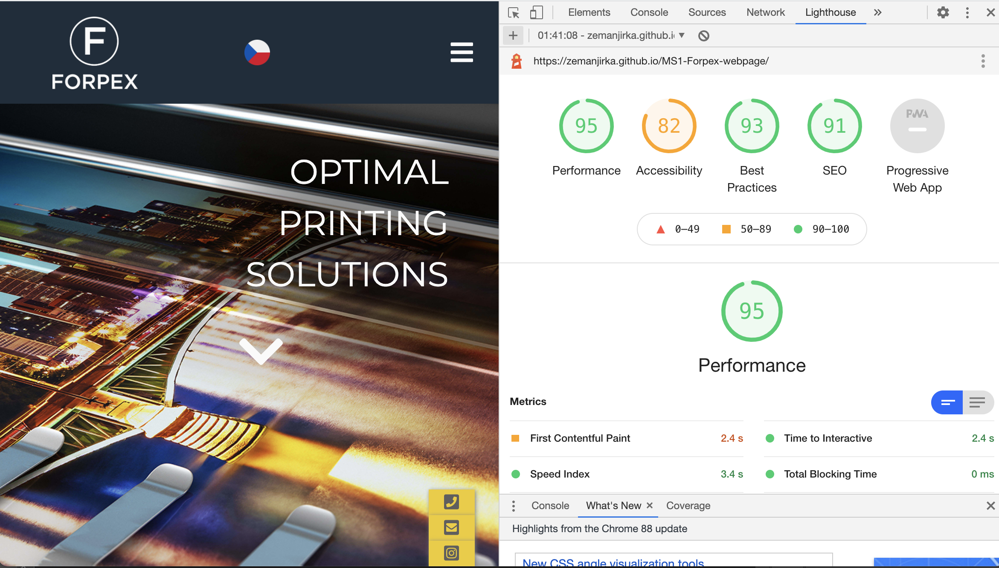

# MS1 - FORPEX webpage

New webpage for existing Czech family firm FORPEX.

 
## UX

FORPEX is a Czech family firm established in 1993. FORPEX specialises in printing. FORPEX was in the past rather succesful, but nowadays with lower demands for printed materials the family focuses on other businesses. The family has established other rather succesful firm and FORPEX was left behind. The business is running, but needs some face-lifting including a new web-page. 

### USER STORIES: 

#### The owners of the firm expect from the new web-page:
- mainly display, that the firm exists, business still runs
- because the firm works with prints and design, the web-page must present certain level of design qualities
- based on their experience, they need to talk to the (potential) clients or exchange emails, they do not want any web-form, questionaire etc., they want client to call them or write a direct email
- their clients are usually banks and state officess so the web-page should be visualy down-to-earth, representing more stability and realiability than creativity and pioneering
- it is clear, that at the moment the other businesses of the owners have priority, so the webpage can not demand any maintanence or activity from the family members

#### From this web-page the user (potentional client) should:
- learn the basic information about FORPEX and fields of its expertise,
- get a feeling, that the firm has an eye for design and looks stabile and reliable,
- get simple and direct way of contacting with the firm - phone, email

Here are wireframes I created at the very beginning of the process (they slightly vary from the final result) https://bit.ly/3bPSAvZ

## Features

- Scroll-down page: the whole page is one scroll-down page with sereval sections (listed below). The project has also second page - which is just the translation in Czech language since FORPEX is a Czech firm and its clients are often Czechs. 
Since FORPEX is print-oriented firm, I used this scroll-down effect with fixed background picture and several empty bars (holes in the scrolling layer) between each section to create remotely effect of a printing head scrolling over a paper. The empty bars are reduced in the mobile-size version of the page. 

Sections:
- Header - simple navigation bar with the logo and language options
- Home page - simple headline on attractive background 
- About us - simple description of the services FORPEX offers with yellow bar underlining FOPREX's expertise
- Printing solutions - simple description of 3 main printing areas FORPEX provides
- Rerefences - logos of main clients (mainly known Czech banks and state offices) and again yellow bar with numbers 
- Contact - simple contact page with the contact info and embedded google-map
- Footer - simple 3 yellow icons (phone, email and instagram), not effected by scrolling - stay all time on the same place of the page - right down corner of the screen. With a hover effect. 
- Credits - very small section at the very bottom of the page - attribution for the flag-icons-designer 

- favicon - logo of the firm

### Features Left to Implement
- according to my quick research, Javascript offers smoother and visually more atractive movement while scrolling - since I am not able to use Javascript yet, I could not implement it already. But I am ready to make the scrolling smoother in the future.
- from Javascript I also expect to learn and implement how to give some interesting slight movement/animation to the images while scrolling
- for better orientation I also plan to highlight active menu items yellow - according to the section of scrolling page. I assume this could be also achieved by Javascript, which I am not yet familiar with. 

## Technologies Used

The whole page was built with HTML, CSS and Javascript (hamburger menu icon)

### Other sources:
- [Bootstrap] (v5.0x) (https://getbootstrap.com/) For some particular details (grid, list-inline etc.)
- [FontAwesome] (https://fontawesome.com/) for using icons
- [GoogleFonts] (https://fonts.google.com/) to use Montserrat font 
- [GoogleMaps] (https://www.google.com/maps) to use embaded map of the firm address
- [Hover.css] (https://ianlunn.github.io/Hover/) to use hover effect on contact icons in the Footer
- [Git] - Git is used to allow for tracking of any changes in the code and for the version control.
- [GitPod] - GitPod, connected to GitHub, hosted the coding space and allowed the project to be committed to the Github repository.
- [Github] - GitHub is used to host the project files and publish the live website by using Git Pages.
- [Balsamiq] (https://balsamiq.com/) for creating the wireframes

## Testing 

https://validator.w3.org/nu/ - Document checking completed. No errors or warnings to show.

http://www.css-validator.org/ -  Congratulations! No Error Found.

lighthouse - dev. tools google chrome: 

### Manually tested all the features:

#### Navigation bar
- always at the top of the page
- in small size screens - logo and language flag icon stay, all other menu items collapse into a hamburger icon
- logo - always at the same place and always if I click on the logo, I come to the Home section of the page
- language flag icon - if I click it, it takes me to the index_cz page, which is the translation of whole english page. This feature works vice versa (also Czech to English)
- all the other menu items (Home, About us, Printing Solutions, References and Contacts) when clicked scroll downt or up the page according to the chosen section. 

#### An arrow down icon 
- used 3 times on the page, suggesting user to click/scroll down, if clicked scrolls to the next section

#### 3 icons in the footer
- telephone icon: when clicked pop-ups a click-to-call window so the user can immediately and directly call the firm 
- e-mail icon: when clicked opens an e-mail client with the firm's email address
- instagram icon: when clicked opens a new browser window with firm's instagram page
- all three icons float up and change color to darker while hovered over
- all of them stay the whole time at the right bottom of the screen for an easy navigation

- the Czech page was tested and works exactly the same way as the English index.html

### Compatibility Testing

#### Browser Compatibility
- Tested on Chrome, Firefox, Opera, Internet Explorer, Microsoft Edge, Safari
- OS Compatibility
- Tested on iOS , Android 10 and Windows 10
- Tested for responsivness on Chrome DevTools

### Covering the Users stories:

#### The owners of the firm through the new web-page:
- display, that the firm exists, business still runs
- prove, that they operate on certain level of design qualities 
- give to their clients direct way to contact the firm (simple click-and-call or pop-up email client with firm's address)

- also (specifically requested by the owners) the new web page does not require any regular activity or maintanence from the owners

#### From this web-page the user (potentional client):
- learns the basic information about FORPEX and fields of its expertise,
- gets a feeling, that the firm has an eye for design and looks stabile and reliable,
- gets simple and direct way of contacting the firm - phone, email (or address with google map)
- can get all the information about the firm in Czech (for locals) or in English (for foreign clients)

### Bugs and problems:
- scrolling down the page on Safari does not work smoothly - page jumps to the navigated sections
- appearence on real mobile phone looks different than phone-size visualization on Chrome dev. tools. The background image on real phone has a different scale.
I still plan to work on this issues in future (together with Features Left to Implement)

### Publishing

This website was published using GitHub Pages. The procedure is outlined below.

- Go to the GitHub website and log in.
- On the left-hand side, you'll see all your repositories, select the appropriate one. (Repository used for this project).
- Under the name of your chosen Repository you will see a ribbon of selections, click on 'Settings' located on the right hand side.
- Scroll down till you see 'GitHub Pages' heading.
- Under the 'Source' click on the dropdown and select 'master branch'
- The page will reload and you'll see the link of your published page displayed under 'GitHub' pages.
- It takes a few minutes for the site to be published, wait until the background of your link changes to a green color before trying to open it.

### Forking

If you wish to contribute to this website you can Fork it without affecting the main branch by following the procedure outlined below.

- Go to the GitHub website and log in.
- Locate the Repository used for this project.
- On the right-hand side of the Repository name, you'll see the 'Fork' button. It's located next to the 'Star' and 'Watch' buttons.
- This will create a copy in your personal repository.
- Once you're finished making changes you can locate the 'New Pull Request' button just above the file listing in the original repository.

### Cloning

If you wish to clone or download this repository to your local device you can follow the procedure outlined below.

- Go to the GitHub website and log in.
- Locate the Repository used for this project.
- Under the Repository name locate 'Clone or Download' button in green.
- To clone the repository using HTTPS click the link under "Clone with HTTPS".
- Open your Terminal and go to a directory where you want the cloned directory to be copied in.
- Type Git Clone and paste the URL you copied from the GitHub.
- To create your local clone press Enter

## Credits

### Content

- all the texts were created by me collaboration between me and the owners family

### Media
- The photos used in this site were obtained from https://depositphotos.com/ and the firm owns full usage rights for all used images

- the Czech and English icons (language switch buttons) made by Freepik from https://flaticon.com/  (required attribution at the very bottom of the page)

### Acknowledgements

- part of the code uses Javascript - the Dropdown Menu - based on w3schools.com tutorial https://www.w3schools.com/howto/howto_js_mobile_navbar.asp